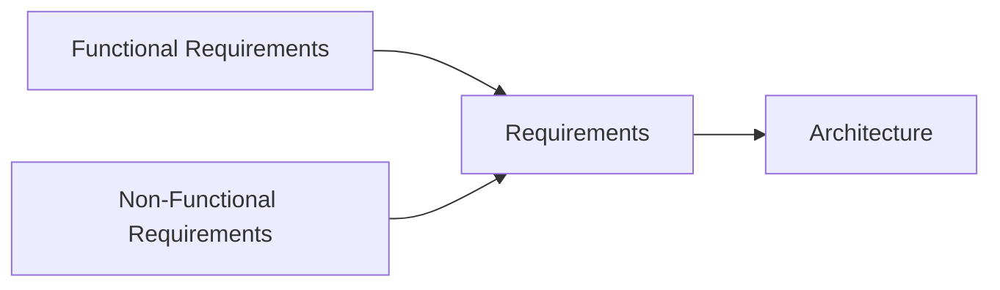

# Embedded Linux Platform Selection

This document gives a short overview of common software platforms used in embedded systems and explains when Embedded Linux is a suitable choice.

---

# Embedded Software Platforms

Embedded systems are commonly built using one of these approaches:

- bare-metal firmware
- RTOS-based systems
- Linux-based systems

The platform choice usually depends on:

- timing requirements
- system complexity
- power consumption
- connectivity requirements
- available hardware resources

---

# Bare-Metal Systems

Bare-metal systems run directly on hardware without an operating system.

## Common use cases

- simple sensors
- small microcontroller projects
- ultra-low-power devices

## Advantages

- minimal overhead
- fast boot time
- very low power usage
- direct hardware access

## Limitations

- no multitasking
- difficult to scale for larger projects
- limited software structure

## Examples

- temperature sensors
- simple control devices
- battery-powered measurement systems

---

# RTOS-Based Systems

RTOS systems provide lightweight multitasking and predictable timing behavior.

## Common use cases

- industrial controllers
- communication devices
- low-power connected systems
- real-time applications

## Advantages

- deterministic timing
- task scheduling
- lower resource usage than Linux
- suitable for real-time systems

## Limitations

- smaller software ecosystem
- more limited userspace support
- increasing complexity in large systems

## Examples

- FreeRTOS
- Zephyr
- ThreadX
- Mbed OS

---

# Linux-Based Embedded Systems

Embedded Linux systems provide a complete operating system environment with networking, filesystems, and multi-process support.

## Common use cases

- edge gateways
- multimedia systems
- industrial Linux devices
- complex IoT products

## Advantages

- large driver and library ecosystem
- mature networking support
- easier third-party software integration
- support for modern development workflows

## Limitations

- higher power consumption
- longer boot times
- larger storage and RAM requirements
- increased system complexity

## Examples

- Raspberry Pi
- Yocto-based systems
- Ubuntu Core
- Buildroot systems

---

# Software Platform Selection

Choosing the software platform is an architectural decision.

Typical design decisions in embedded systems include:

- operating system selection
- communication protocols
- connectivity technologies
- cloud vs edge processing
- security architecture

Examples:

- BLE, Wi-Fi, LoRaWAN, ZigBee
- MQTT, CoAP, HTTPS
- OTA firmware updates
- secure boot and authentication

---

# Product Development Flow

---

# Functional Requirements

Functional requirements describe what the system should do.

## Examples

| Requirement     | Description                         |
| --------------- | ----------------------------------- |
| Sensor Sampling | Read temperature every 5 seconds    |
| Connectivity    | Connect to cloud using MQTT         |
| Alerts          | Generate alarms on threshold events |
| OTA Updates     | Support remote firmware updates     |

---

# Non-Functional Requirements

Non-functional requirements describe how the system should behave.

These requirements often drive architectural decisions.

## Common examples

- power consumption
- latency
- reliability
- scalability
- security
- maintainability
- cost

## Examples

| Requirement       | Description                             |
| ----------------- | --------------------------------------- |
| Power Consumption | Device should run for 7 days on battery |
| Performance       | Sensor latency below 50 ms              |
| Security          | TLS encrypted communication             |
| Availability      | 99.9% uptime                            |
| Scalability       | Support many connected devices          |

---

# Architecture Decisions

In embedded systems, non-functional requirements often determine whether the system should use:

- bare-metal firmware
- an RTOS
- Embedded Linux

---

# Example: Low-Power Wearable Device

Consider a wearable health monitoring device with:

- continuous sensor sampling
- Bluetooth connectivity
- compact hardware
- long battery life requirements

A Linux-based system may provide strong networking and software support, but power consumption may be too high for the target device.

An RTOS-based solution may therefore be a better choice because it provides:

- lower power consumption
- deterministic scheduling
- smaller memory footprint

This is a common example of how non-functional requirements affect software platform selection.

---

# Key Takeaways

- Embedded Linux is suitable for complex connected systems with enough hardware resources.
- RTOS platforms are commonly used for real-time and low-power applications.
- Bare-metal systems are still useful for very small and resource-constrained devices.
- Non-functional requirements often have the biggest impact on architecture decisions.
