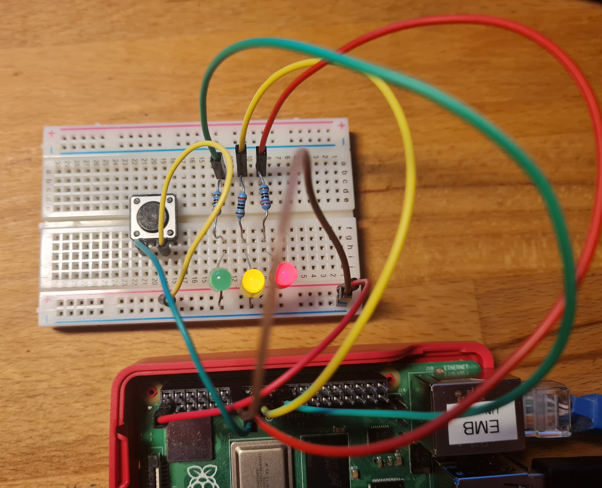

# Raspberry Pi GPIO Events and Debounce

GPIO event handling project using `libgpiod`, POSIX threads, and C on Raspberry Pi.

The project detects button events using GPIO edge interrupts and filters switch bouncing with a simple software debounce mechanism.

---

## Features

- GPIO event detection using `libgpiod`
- rising and falling edge handling
- button input handling
- LED output control
- POSIX thread for GPIO event handling
- software debounce
- non-blocking main loop behavior

---

## Hardware

- Raspberry Pi running Raspberry Pi OS
- push button
- red LED
- yellow LED
- green LED
- resistors
- breadboard and jumper wires
- oscilloscope (optional)

---

## GPIO Mapping

| Function   | GPIO |
| ---------- | ---- |
| Button     | 22   |
| Red LED    | 23   |
| Yellow LED | 24   |
| Green LED  | 25   |

---

## Hardware Setup



---

## Run

```bash
./rpi_gpio_events_debounce
```

The program starts two main activities:

1. the main loop updates LED outputs
2. a separate thread waits for GPIO button events

Detected button presses are printed to the terminal.

---

## How It Works

The button GPIO line is configured to detect both edges:

- falling edge = button press
- rising edge = button release

A separate POSIX thread waits for GPIO events using `gpiod_line_event_wait()`.

This prevents the main loop from being blocked by GPIO event waiting.

The debounce logic ignores repeated edges that occur inside a short debounce time window.

---

## Why Debounce Is Needed

Mechanical buttons do not produce a clean single transition.

When pressed or released, the signal may rapidly switch between HIGH and LOW several times before settling.

This is called switch bouncing.

Without debounce, one physical button press may be detected as multiple presses.

---

## Additional Documentation

- [Polling vs GPIO Events](docs/polling-vs-events.md)

---

## Project Structure

```text
.
├── CMakeLists.txt
├── README.md
├── docs
│   └── polling-vs-events.md
├── images
│   └── example-circuit.png
└── src
    └── gpio-events-debounce.c
```

---

## Notes

This project uses the Linux GPIO character device interface through `libgpiod`.

GPIO event handling is more efficient than repeatedly polling the input state in a loop.
