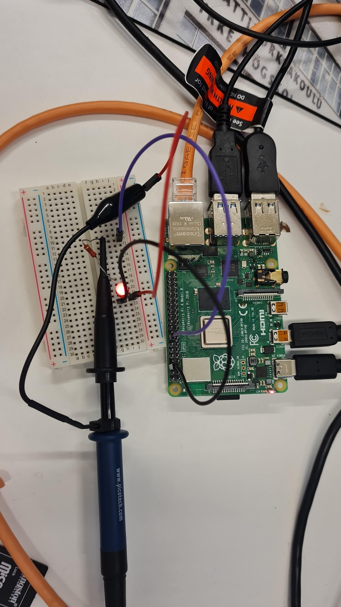
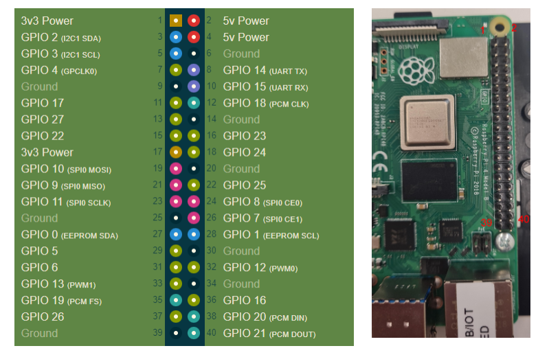

# Raspberry Pi GPIO Button & LED Controller

GPIO button and LED control project using `libgpiod` and C on Raspberry Pi.

The application measures button press duration and generates a matching LED pulse train output.

---

## Features

- GPIO control using `libgpiod`
- LED output control
- button input handling
- internal GPIO pull-up configuration
- button press duration measurement
- LED pulse train generation
- log file output

---

## Hardware

- Raspberry Pi running Raspberry Pi OS
- LED
- push button
- 220 Ω resistor
- breadboard and jumper wires
- oscilloscope (optional)

---

## GPIO Mapping

| Function | GPIO   |
| -------- | ------ |
| LED      | GPIO23 |
| Button   | GPIO22 |

---

## Hardware Setup

### Example setup



### Raspberry Pi pin locations



---

## Build

```bash
mkdir build
cd build
cmake ..
make
```

---

## Run

```bash
./rpi_gpio_button_led
```

The application creates a log file:

```text
button.log
```

Example:

```text
press=700 ms, pulses=7
press=300 ms, pulses=3
```

---

## How It Works

- the button input uses a pull-up resistor configuration
- released button state = logical `1`
- pressed button state = logical `0`

The application:

1. waits for a button press
2. measures button press duration
3. stores the measurement into a log file
4. generates an LED pulse train

Pulse train format:

- 10 ms HIGH
- 90 ms LOW

One pulse represents approximately 100 ms of button press duration.

Example:

- 730 ms button press
- approximately 7 LED pulses

---

## Additional Documentation

- [GPIO pull-up configuration](docs/gpio-pullup.md)
- [Hardware setup and timing measurements](docs/hardware-setup.md)

---

## Project Structure

```text
.
├── CMakeLists.txt
├── README.md
├── docs
│   ├── gpio-pullup.md
│   └── hardware-setup.md
├── images
│   ├── example-setup.jpeg
│   ├── pin-locations.png
│   └── two-ways-to-wire-switch.jpg
└── src
    └── button-led.c
```
