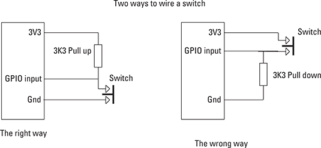

# GPIO Pull-Up Configuration on Raspberry Pi

GPIO pins on Raspberry Pi can operate either as inputs or outputs.

Input pins also support configurable bias resistors:

- pull-up
- pull-down
- disabled

These resistors prevent floating input states and make button handling more reliable.

---

## Checking GPIO Configuration

Use:

```bash
gpioinfo
```

This shows all available GPIO lines and their current configuration.

Example:

```text
line 22: "GPIO22" unused input active-high
line 23: "GPIO23" unused output active-high
```

In this project:

- GPIO22 → button input
- GPIO23 → LED output

---

## GPIO CLI Utilities

`libgpiod` provides several command-line tools:

| Command    | Purpose                    |
| ---------- | -------------------------- |
| `gpioinfo` | Display GPIO configuration |
| `gpioget`  | Read GPIO input values     |
| `gpioset`  | Set GPIO output values     |
| `gpiomon`  | Monitor GPIO events        |
| `gpiofind` | Find GPIO lines by name    |

---

## Configuring Pull-Up Bias

Show available options:

```bash
gpioget -h
```

Relevant option:

```text
-B, --bias=[as-is|disable|pull-down|pull-up]
```

---

## Why Pull-Up Resistors Are Needed

A GPIO input pin must never be left floating.

For button inputs, the common approach is:

- connect one side of the button to GPIO
- connect the other side to GND
- enable a pull-up resistor

Behavior:

| Button State | GPIO Value |
| ------------ | ---------- |
| Released     | 1 (HIGH)   |
| Pressed      | 0 (LOW)    |

The pull-up resistor keeps the input stable at HIGH until the button connects the pin to ground.

---

## Wiring Example



---

## Enable Internal Pull-Up

Example for GPIO22:

```bash
gpioget --bias=pull-up gpiochip0 22
```

This enables the Raspberry Pi internal pull-up resistor and removes the need for an external resistor.

---

## Using Pull-Up Configuration in C

The project enables the pull-up using a simple system call:

```c
system("gpioget --bias=pull-up gpiochip0 22");
```

Example:

```c
btn = gpiod_chip_get_line(chip, BTN_LINE);

gpiod_line_request_input(btn, CONSUMER);

system("gpioget --bias=pull-up gpiochip0 22");
```

---

## Notes

- Internal pull-up support may behave differently on some Raspberry Pi models
- External pull-up resistors are usually more reliable in production hardware
- Floating GPIO inputs may produce unstable or random values
