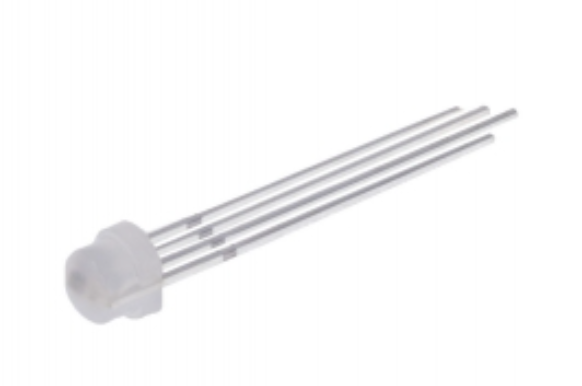

# Raspberry Pi Multi-purpose Knob Controller

Multi-purpose Raspberry Pi controller using a rotary encoder, hardware PWM, GPIO event handling, POSIX threads, and a WS2812 RGB LED.

The project combines multiple embedded Linux concepts into a single interactive controller with two operating modes:

- WS2812 RGB LED color control
- servo motor position control

A rotary encoder is used for input and an additional LED indicates the active operating mode.

---

## Features

- rotary encoder input handling
- mode switching using a push button
- WS2812 RGB LED control using SPI
- servo motor control using hardware PWM
- mode indicator LED
- POSIX threads
- GPIO control using `libgpiod`
- simple software debounce
- hardware PWM using Linux sysfs
- state-based controller logic

---

## Hardware

- Raspberry Pi running Raspberry Pi OS
- KY-040 rotary encoder
- WS2812 RGB LED
- servo motor
- LED for mode indication
- breadboard and jumper wires
- oscilloscope (optional)

---

## GPIO Mapping

| Function           | GPIO |
| ------------------ | ---- |
| Encoder CLK        | 17   |
| Encoder DT         | 27   |
| Encoder Button     | 24   |
| Mode Indicator LED | 23   |
| Servo PWM          | 18   |
| WS2812 SPI MOSI    | 10   |

---

## Operating Modes

### LED Mode

- rotary encoder changes WS2812 RGB LED color
- mode indicator LED is OFF

### Servo Mode

- rotary encoder controls servo position
- WS2812 LED keeps its current color
- mode indicator LED is ON

---

## WS2812 RGB LED

The project uses a WS2812 addressable RGB LED controlled through the Raspberry Pi SPI interface.

Instead of bit-banging the GPIO manually, the implementation encodes WS2812 timing into SPI byte patterns.

SPI timing approximation:

- SPI speed: approximately 6.5 MHz
- encoded SPI patterns represent WS2812 logical `0` and `1`

### Example WS2812 LED



---

## Hardware PWM

Hardware PWM is used for servo motor control through:

```text
/sys/class/pwm/pwmchip0/
```

Servo PWM settings:

| Parameter | Value |
| --------- | ----- |
| Frequency | 50 Hz |
| Period    | 20 ms |

---

## Enable Hardware PWM

Edit Raspberry Pi configuration:

```bash
sudo nano /boot/firmware/config.txt
```

Add:

```text
dtoverlay=pwm-2chan
```

Reboot:

```bash
sudo reboot
```

---

## Enable SPI

Enable SPI using:

```bash
sudo raspi-config
```

Navigate to:

```text
Interface Options → SPI → Enable
```

Verify:

```bash
pinctrl get 10
```

Expected:

```text
10: a0    pd | lo
```

---

## Build

```bash
mkdir build
cd build
cmake ..
make
```

---

## Run

```bash
./rpi_multipurpose_knob_controller
```

The application starts separate threads for:

- rotary encoder handling
- mode button handling

---

## Controller Logic

The controller stores:

- current operating mode
- current RGB LED color position
- current servo position

The rotary encoder generates increment/decrement events which are routed differently depending on the current mode.

---

## Rotary Encoder Noise

Rotary encoders can generate noisy signals and switch bouncing.

This project includes experiments with:

- bypass capacitors
- RC filtering
- debounce timing
- signal rise time effects

Additional notes:

- [Signal Noise Filtering](docs/signal-noise-filtering.md)
- [KY-040 Rotary Encoder Datasheet](docs/ky-040-rotary-encoder-datasheet.pdf)
- [WS2812D-F5 Datasheet](docs/ws2812d-f5-datasheet.pdf)

---

## Project Structure

```text
.
├── CMakeLists.txt
├── README.md
├── docs
│   ├── ky-040-rotary-encoder-datasheet.pdf
│   ├── signal-noise-filtering.md
│   └── ws2812d-f5-datasheet.pdf
├── images
│   ├── cap-charging.jpg
│   ├── cap-effect-on-rise-time.jpg
│   ├── capacitor-as-lpf.jpg
│   ├── noisy-signal.jpg
│   └── ws2812.png
└── src
    ├── main.c
    ├── controller.c
    ├── controller.h
    ├── button.c
    ├── button.h
    ├── knob.c
    ├── knob.h
    ├── mode_led.c
    ├── mode_led.h
    ├── servo.c
    ├── servo.h
    ├── ws2812_led.c
    └── ws2812_led.h
```
