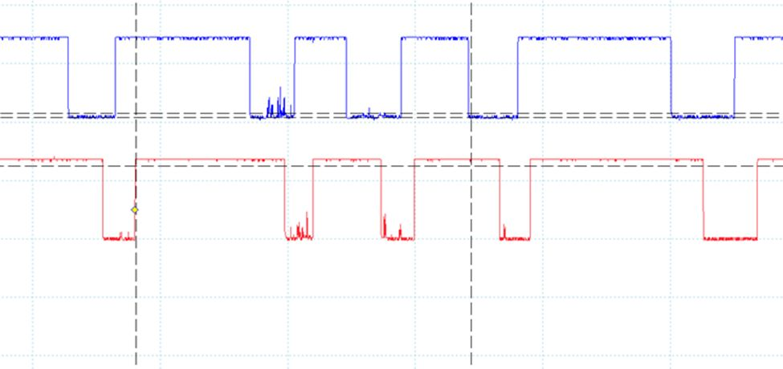
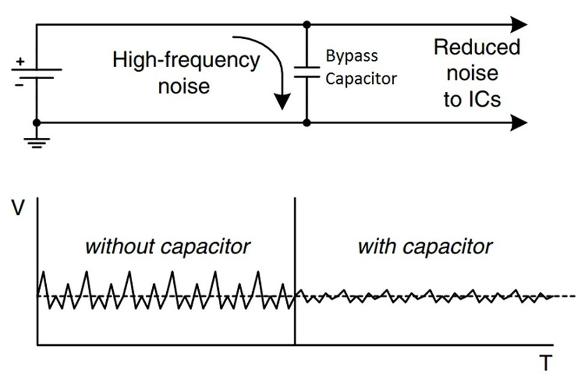
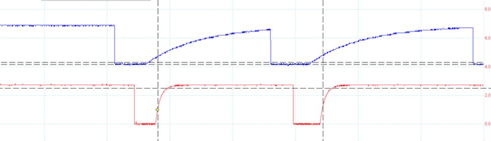
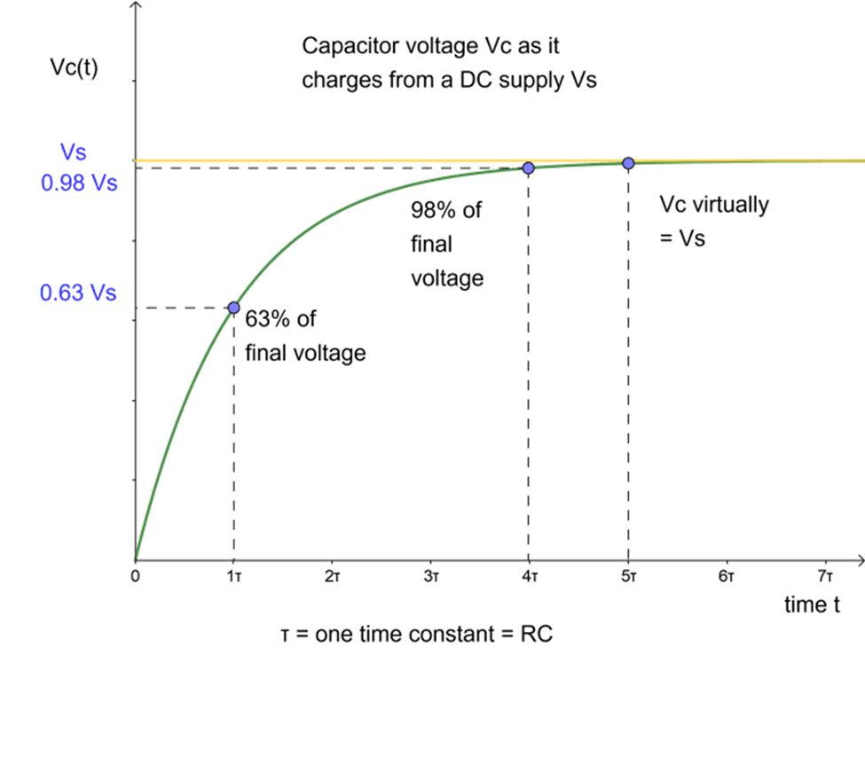

# Signal Noise Filtering for Rotary Encoders

Rotary encoders can generate noisy signals and unstable transitions during rotation.

Long wires, weak pull-up resistors, and switch bouncing may cause unreliable GPIO readings and incorrect direction detection.

This document describes simple hardware filtering methods that were tested during development of the rotary encoder controller.

---

## Noisy Encoder Signals

Example of a noisy rotary encoder signal:



Without filtering, the GPIO input may detect:

- false edges
- repeated transitions
- incorrect rotation direction
- unstable operation

---

## Bypass Capacitors

One simple filtering method is to add capacitors between the encoder signal lines and ground.

Typical placement:

- CLK → capacitor → GND
- DT → capacitor → GND

The capacitors suppress high-frequency noise components.

This creates a simple RC low-pass filter.

### Capacitor as low-pass filter



---

## Signal Rise Time

Filtering improves signal quality but also affects signal rise time.

Example:



Observed behavior:

- larger capacitor → cleaner signal
- larger capacitor → slower rising edge

Example comparison:

- 1 µF capacitor → very slow rise time
- 100 nF capacitor → cleaner signal with acceptable timing

Large capacitors may distort encoder timing enough to cause incorrect GPIO readings.

---

## RC Filter Behavior

The pull-up resistor and capacitor together form an RC filter.

RC time constant:

```text
τ = R × C
```

The capacitor charging curve:



Effects:

- larger capacitance → stronger filtering
- larger capacitance → slower signal transitions

The final signal value is approached gradually rather than instantly.

---

## Practical Observations

During testing:

- small capacitors reduced encoder noise significantly
- large capacitors caused unreliable edge timing
- approximately 100 nF produced stable operation
- approximately 1 µF caused excessive rise time delay

Signal quality depends on:

- wire length
- GPIO pull-up strength
- encoder quality
- noise sources nearby

---

## Software and Hardware Filtering

This project combines:

- hardware filtering using bypass capacitors
- software debounce inside the GPIO handling code

Using both methods together improved rotary encoder stability considerably.

---

## Conclusion

Rotary encoders can produce noisy and unstable signals in embedded Linux systems.

Simple RC filtering using bypass capacitors can improve signal quality significantly, but capacitor size must be selected carefully to avoid excessive signal delay.
